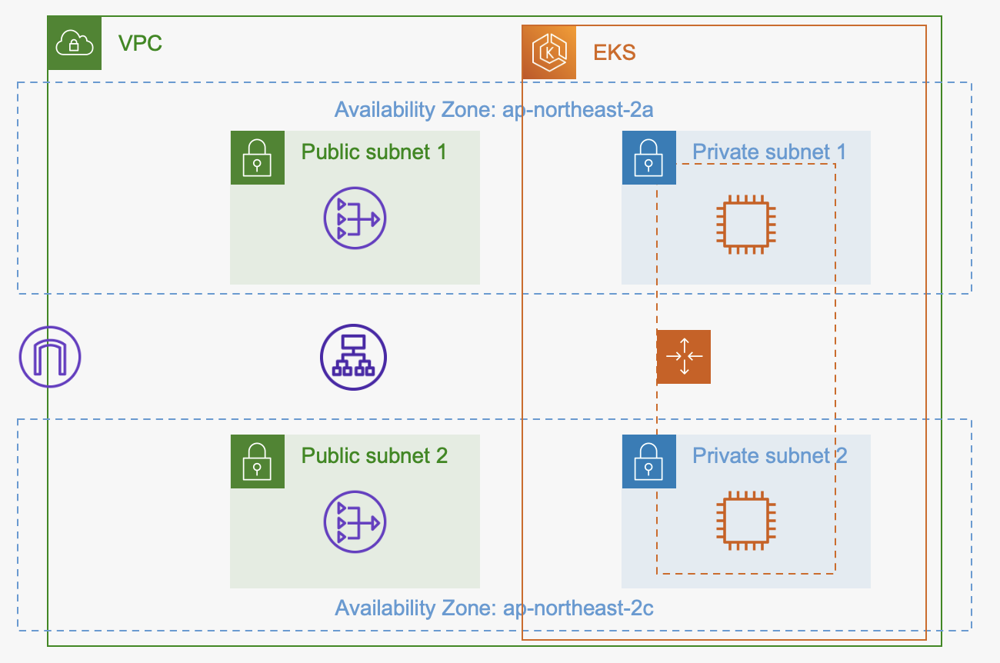
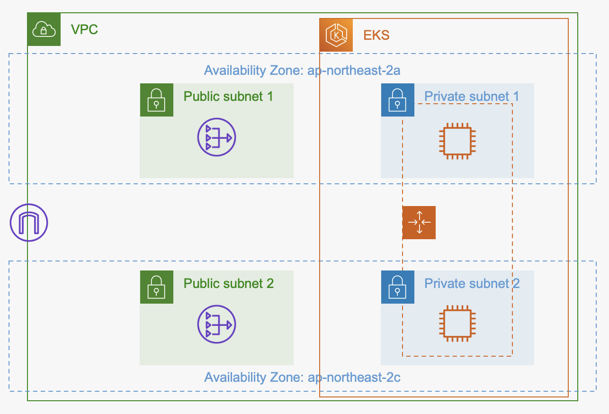
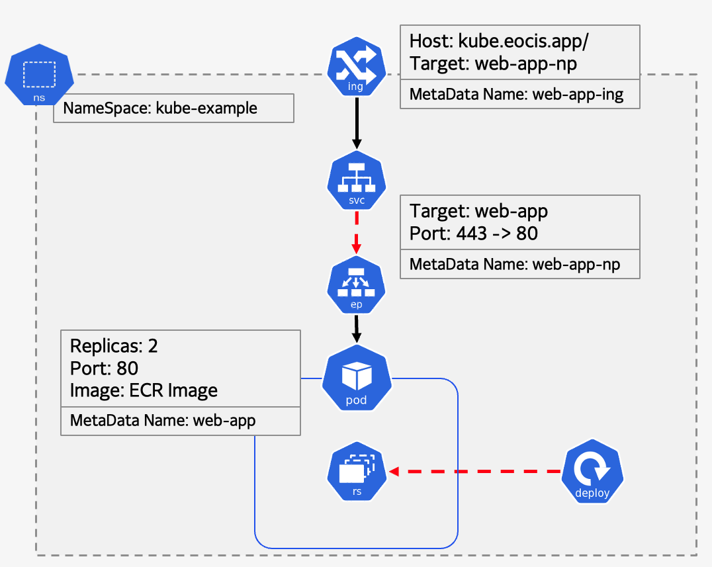

> ## 전체 구조


> ## AWS Infra 구조


> ## EKS Cluster 구조
  


> ## How to Use?

Edit: /stage/k8s/apply.yml (line 23 : image, line 56 : ACM(cert_arn), line 59 : host)  
Edit: /stage/main.tf (line 1 ~ 11: delete)


```sh
> terraform apply --auto-approve
# output결과물을 k8s 디렉토리 내부 apply.yml Subnet에 대입

> aws eks --region <region> update-kubeconfig --name <cluster_name>

> helm repo add eks https://aws.github.io/eks-charts

> helm install aws-load-balancer-controller eks/aws-load-balancer-controller -n kube-system --set clusterName=<cluster_name>

> kubectl apply -f ./stage/k8s/apply.yml

> kubectl describe ingress -n kube-example | grep Address   # 해당 주소를 DNS CNAME에 등록


### ! 에러시 ! ###

# awscli 버전 확인
> aws --version

# apply.yml이 적용되었는지 확인
> kubectl get all -n kube-example

# Ingress 확인
> kubectl describe ing -n kube-example

# Pod 확인
> kubectl describe po -n kube-example

# NordPort 확인
> kubectl describe service web-app-np -n kube-example

# ECR Repository 확인
> aws ecr describe-images --repository-name <ECR-Repository-Name>
```

> ## About Code

### [/stage/main.tf]

- Provider: AWS, Kubernetes

- Module: VPC, EKS
    - VPC: ALB-Ingress-Controller를 위한 Subnet Tagging 추가
    - EKS: Node_Group의 AutoScaling Template 수정 (Default: m4.large, gp2, 100gb)

- Resource: IAM_role_policy
    - Ingress를 통해 생성되는 ALB 권한을 EKS node_group에 부여

### [/stage/data.tf]

- EKS 최적화 EC2 AMI 정보
- EKS Cluster Name 정보
- EKS Cluster Authority 정보

### [/stage/output.tf]

- Ingress ALB 설정에 필요한 Subnet ids

### [/stage/variable.tf]

- Region
- VPC CIDR
- AZS
- Subnet CIDR
- AMI
- EKS Node Group Instance Type
- EKS Node Group Root Volume Type
- EKS Node Group Root Volume Size
- EKS Node Group Desired Capacity
- EKS Node Group Max Capacity
- EKS Node Group Min Capacity

### [/stage/kubeconfig_<cluster_name>]

- AWS EKS Cluster kubeconfig 파일 (~/.kube/config)

### [/stage/k8s/sample_kube.yml]

- NameSpace: kube-example
    - Default NameSpace가 아닌 별도의 NameSpace를 만들어 구축
    - metadata.name: kube-example

- Deployment: web-app
    - <b>2048 웹게임 이미지를 사용</b>
    - spec.template.metadata.labels.app: web-app
    - spec.template.spec.containers.image: 26426825780.dkr.ecr.ap-northeast-2.amazonaws.com/kube-images:2048
    - spec.template.spec.containers.ports.containerPort: 80

- Service(NodePort): web-app-np
    - <b>CluterIP 대신 NodePort를 만들어 연결</b>
    - spec.ports.port: 443
    - spec.ports.targetPort: 80
    - spec.ports.protocol: TCP
    - metadata.name: web-app.np
    - spec.selector.app: web-app

- Ingress: web-app-ing
    - <b>AWS EKS자원을 LoadBalancer를 통해 부하 분산시키기 위해서는 Ingress-Controller를 두어야 함</b>
    이는 Docs에 있는 샘플 파일을 참고하여 Ingress코드를 작성
    - metadata.name: web-app-ing
    - spec.rules.host: kube.eocis.app
    - spec.rules.http.paths.backend.service.name: web-app-np
    - spec.rules.http.paths.backend.service.port.number: 443


참고: https://kubernetes-sigs.github.io/aws-load-balancer-controller